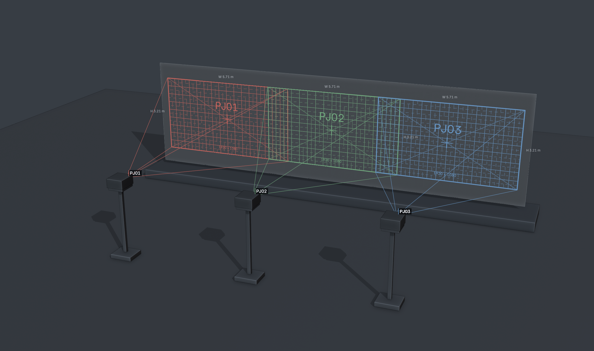

# Beam

**Projection planning and screen building in Blender.** Maintained by **Twisted Pixel** · **0.8.1 — pre-release beta**

> **Still in testing.** Beam is a pre-release beta, not a stable production release. Expect bugs, incomplete workflows and changes between versions. Keep backups of your Blender files and independently verify geometry, measurements and exported data before production use.

Use Beam to place projectors in a venue model, preview coverage and obstructions, plan overlapping projector groups, build projection screens or LED walls, and export study images and geometry.



*Actual Beam viewport capture: three projectors, visible throw frustums, projected IDs and overlapping coverage on a 16 m screen.*

## Install the beta

Beam requires **Blender 4.5 or newer**. It has been tested on **Blender 5.2.2 LTS on macOS/Metal**; other versions and platforms have not yet been verified.

### Create the installable ZIP

The repository contains the source. To build the extension ZIP, use **Python 3.11 or newer**:

```sh
git clone https://github.com/twistedpixelpete/beam.git
cd beam
python3 tools/build_release.py
```

Alternatively, choose **Code → Download ZIP** on GitHub, extract it, and run `python3 tools/build_release.py` from the extracted folder. Python is needed only for this packaging step, not to run the installed add-on.

The script creates `dist/beam-0.8.1.zip`. **Install this file, not GitHub’s source ZIP or `beam-source-0.8.1.zip`.**

### Install in Blender

1. Open **Edit → Preferences → Get Extensions**.
2. Open the menu at the top right and choose **Install from Disk**.
3. Select `beam-0.8.1.zip` and enable Beam if prompted.
4. In the 3D View, press **N** to open the sidebar, then select **Beam**.

When upgrading, replace the existing extension rather than enabling a second copy. Restart Blender after upgrading. Older files remain compatible; the internal extension name is still `projection_study`.

## Make your first projection study

This example produces a **6 × 3.375 m** image on a flat screen.

1. Start a new scene and remove the default cube so it will not block the projection. In **Scene Properties → Units**, choose Metric and leave Unit Scale at **1.0**. Leave the 3D cursor at the world origin.
2. Open **Beam → Screen Builder → Create Screen**. Choose **Flat**, category **Projection**, Width **6**, Height **3.375**, and Aspect **Free**. Click **Create Screen**.
3. With the screen selected, set its Location to **X 0, Y 6, Z 0** in Blender’s Item panel. Leave rotation at zero and scale at one. Its default origin is Bottom Centre.
4. Under **Beam → Projector**, click **Add Projector**. Set its Location to **X 0, Y 0, Z 1.6875**. A new projector already faces the screen along world +Y.
5. Under **Projection**, set Throw Ratio to **1.0**, resolution to **1920 × 1080**, and both lens shifts to **0**. Choose **Calibration Grid** for Output.
6. Check **Calculated**. With an unobstructed centre ray, Throw should be **6 m** and Image should be **6 × 3.375 m**.
7. Under **Display**, choose **Presentation View** for a cleaner view. Choose **Technical View** to restore your previous viewport settings.
8. Save your `.blend` file. It stores the projectors, screens, groups and saved views.

A Beam screen is optional: ordinary visible venue geometry can receive the projection too. Keep projectors and their parents at scale **1**; position and rotate them with Blender’s normal tools.

## Position and aim projectors

Use **Projector → Add Projector** or **Duplicate**. Blender’s normal duplicate and copy/paste workflows also create independent Beam projector identities.

Under **Aim / Position**:

- **Click Surface:** click a visible surface to aim at it; press Esc to cancel.
- **Object Centre:** select the receiving object, then aim the retained active projector at that object’s origin.
- **3D Cursor:** aim at the cursor’s position.
- **Look Through:** inspect the projector’s view; press Esc to return.
- **Further / Closer:** move along the aim direction while retaining the aim point.

The **Active** field identifies the projector being edited, even when you select venue geometry. Use **Frame** to find it, **Solo** to isolate its study output, and **Lock / Unlock** to protect or adjust its position.

Under **Projection**, set throw ratio, resolution, lens shift, lumens, brightness and stack count. Choose a solid colour, calibration grid, identifier, checkerboard, Blender grid, or custom image. Custom Image reveals an image selector.

**Calculated** reports nominal image size, density, pixel size, DPI and estimated illuminance. These describe the reference image at the centre target, not a full analysis of distortion or brightness across a curved surface. Metres/Millimetres changes display formatting, not scene scale.

## Build and edit screens

Open **Screen Builder → Create Screen**, choose a type, enter its parameters, then click **Create Screen**.

| Type | Use it for |
| --- | --- |
| Flat | A rectangular screen with width, height and optional fixed aspect ratio. |
| Arc | A circular screen defined by combinations of radius, angle, arc length or chord. |
| Curve | A screen extruded from one selected Bezier, Poly or NURBS spline. Set the source and height. |
| Closed | A cylindrical screen, including a full 360° surface with a UV seam. |
| Surface | A copy of an existing mesh or selected faces, with existing or generated UVs. |

Fields marked **(m)** always take physical metres: enter **0.5** for 500 mm. Ordinary generated screens face local −Y, toward a new Beam projector facing +Y.

To edit a screen:

1. Select it in the viewport or Outliner.
2. Change its name or parameters under **Screen**. Width comes before Height for flat screens.
3. Click **Update Screen** to rebuild it. Parameter and source-curve edits do not rebuild automatically.
4. Use **Actions → Duplicate** for another screen, or **Flip Front** to reverse its facing direction.

For Curve or Surface, select the source and use **Use Selected Source** before creating the screen. The source remains intact. For an existing mesh with authored mapping, choose **Existing UV**. Surface Distance mapping supports rectangular quad grids; use authored UVs for more complex shapes.

### Appearance and labels

- **Appearance → Clean Pattern** applies the modern calibration chart. Use this to refresh charts saved by an older Beam version.
- **Neutral Surface** returns to the plain screen material, useful when inspecting projector output.
- **Border** toggles the screen outline.
- **Labels** controls Screen ID and Dimensions independently. Width sits below the screen and height beside it.
- **Detail → Off** hides measurement and technical overlays; the enabled screen ID can remain. **Minimal** shows the ID and dimensions. **Full** adds name, resolution and enabled technical information.

Detail and m/mm settings are shared with projector annotations. They do not remove text printed inside the Clean pattern, whose physical size is shown in metres. Presentation View temporarily uses Minimal detail.

### LED walls

Choose category **LED** with Flat, Arc or Closed. Enter cabinet width/height/depth, pixels per cabinet, columns and rows. For example, **0.5 × 0.5 m**, **192 × 192 px**, **20 columns × 8 rows** gives a **10 × 4 m**, **3840 × 1536 px** wall.

For an arc, choose **Smooth** for a continuous curve or **Faceted Cabinets** for flat cabinet faces joined at an angle. The included cabinet presets are generic examples, not manufacturer specifications.

For conforming, baking, UV diagnostics and detailed cabinet geometry, see the [Screen Builder guide](docs/SCREEN-BUILDER.md).

## Make a multi-projector blend

1. Position and configure the first projector. It becomes the group’s anchor.
2. Choose **Projector → Create Blend**. Select Horizontal, Vertical or Array, the count, and desired overlap.
3. Open **Blend Group** to adjust overlap in pixels, percent or metres. Compare **Desired** with **Actual** for each adjacent pair.
4. Enable **Overlap** to inspect the nominal overlap regions. Use **Feather** for a simple edge-blend preview and **Combined Preview** to spread the anchor’s output across the group canvas.
5. Use **Select Controller** to move or rotate the whole group. Keep its scale at one.

To group projectors you already positioned, select them and use **From Selected**. This preserves their positions. The member list provides selection, Add Member, New Projector, Remove and Duplicate controls.

After changing anchor optics or distance, use **Reflow** to recalculate spacing. **Reflow clears member position tweaks**; aiming and lens shifts remain. **Reset Member** clears only the active member’s positional tweak. **Ungroup** preserves the projectors and their world positions.

Overlap is measured on a nominal reference plane, not across every point on curved or obstructed receivers. When the anchor misses geometry, Beam explicitly labels the reference as a preview plane.

## Save views and export images

1. Optionally fill in **Project Details**: project name, venue, revision, client and author.
2. Navigate to the view you want to keep.
3. Open **Study Views → Add View** and give it a useful name.
4. Use **View**, **Previous**, **Next** and **Exit** to navigate saved views.
5. Under **View Options**, choose output dimensions and which Beam overlays to include.
6. Choose **Export View** or **Export All**, then select the destination and filenames. Use **Capture** to save the current composited editor view instead.

Presentation View supplies a neutral, uncluttered style for study images. Default filenames use project, revision and view names, such as `Town_Hall_R02_Front_Coverage.png`. Filenames are editable; replacing existing files requires the overwrite option.

**Projector projection is a viewport effect. Use Beam’s image export for coverage studies; it is not included in a normal F12 render.**

## Export data or screen geometry

| What you need | Where to find it | What it produces |
| --- | --- | --- |
| Projector table | **Beam → Export → Export CSV** | Mapping Matter/disguise-style projector rows. Included projectors need valid targets and unit scale. |
| Structured study data | **Beam → Export → Export JSON** | Projector/group metadata, calculations, transforms and view information. See the [JSON contract](docs/BEAM-JSON-V1.md). |
| Screen mesh | Select a screen → **Screen Builder → Export Geometry** | OBJ or FBX with the evaluated display surface and UVs. |

For screen geometry, choose **Production Surface** for the display only, or **Detailed / Previs** to include available LED backing. Choose **World Metres** to bake its scene placement or **Screen Local Metres** for geometry at its own origin. Exports omit preview materials, annotations and unrelated scene objects.

Click **Update Screen** before exporting pending parameter changes. Use **Diagnostics → Validate Geometry / UV** to investigate invalid mapping or geometry. Screen metadata stays in the `.blend` file; it is not added to the projector JSON contract.

OBJ/FBX uses metres with Blender +Z up / +Y forward. Check the receiving application’s units and axes. The CSV Designer transform convention has not been validated end to end; test the handoff before relying on it for production.

## Troubleshooting

| Symptom | Check |
| --- | --- |
| Beam is missing from the sidebar | Enable the extension, place the pointer over the 3D View, press N, and choose the Beam tab. Restart after upgrading. |
| “No centre hit” | Aim the centre ray at visible geometry and check for intervening objects. Off-centre parts of the image can still project when its centre misses. |
| Projection is missing | Check **Display → Projected Output**, the active projector’s **Projection Output**, and any Solo setting. Use a neutral screen surface to distinguish projection from its own test chart. |
| Projector cannot move or aim | Unlock it under Projector. Check Blender transform locks and parent scale. |
| Screen edits have not appeared | Select the screen and click Update Screen. |
| Screen technical markers are missing | Choose Full detail and enable the relevant Technical Overlays. |
| Screen export is refused | Apply pending updates, check scene units, run UV diagnostics, and choose a new filename or enable overwrite. |
| Labels overlap or leave the view | Use Minimal detail, disable unneeded labels, or frame the scene more widely. |
| Thin occlusion edges look jagged | Increase **Display → Preview Quality**; higher settings cost GPU performance. |

Beam is a planning tool, not a calibrated photometric or edge-blending system. Projection treats geometry as opaque; group previews do not implement calibrated gamma, black-level correction or warped-surface optimisation. Large scenes and many projectors need project-specific performance checks.

## Examples and further reading

- [Three-projector showcase](examples/0.8.1/Beam-Projector-Showcase.blend) — the scene pictured above, with an editable saved study view.

- [Screen Builder demonstration](examples/0.8/Beam-Screen-Builder.blend) — screen types, LED examples and a projector group. Download the file, then open it with Beam enabled.
- [Clean screen demonstration](examples/0.8.1/Beam-Screen-Beauty.blend) and [sidebar screenshot](examples/0.8.1/sidebar.png).
- [Screen Builder reference](docs/SCREEN-BUILDER.md) — geometry, UVs, conforming and export conventions.
- [Screen appearance guide](docs/SCREEN-BEAUTY.md) — labels, chart styling and visual limitations.
- [JSON schema reference](docs/BEAM-JSON-V1.md) and [test results](TEST_RESULTS.txt).

For development, run `python3 -m unittest discover -s tests -p 'test_*.py'`. Blender integration scripts belong in disposable Blender sessions; some create scenes and quit the process. See the reference guides before running them against your own files.

Licensed under **GPL-3.0-or-later**.
